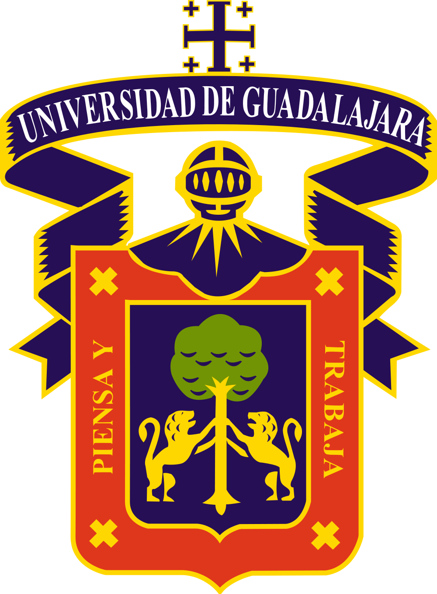
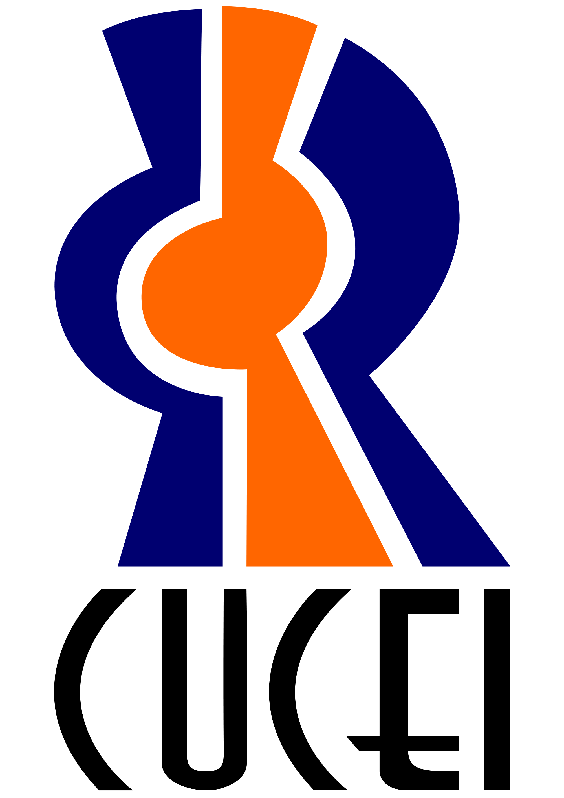

  

 

# 
Proyecto

### 
Universidad de Guadalajara

#### 
Centro Universitario de Ciencias Exactas e Ingenierías

#### 
División de Electrónica y Computación

#### 
Departamento de Ciencias Computacionales

#### 
Ingeniería en Computación

### 
Seminario de Solución de Problemas de Traductores de Lenguajes II

#### 
Profesor: López Franco, Michel Emanuel

### 
César Arley Ojeda Escobar

## Modulos
+ Módulo 1: Los símbolos léxicos del compilador.
+ Módulo 2: Ejemplos LR(1)
+ Módulo 3: Practica de analizador Sintáctico LR
+ Módulo 4: Gramática del Compilador
+ Módulo 5: *Análisis semántico* Práctica análisis semántico
+ Módulo 6: Practica Árbol Sintáctico

