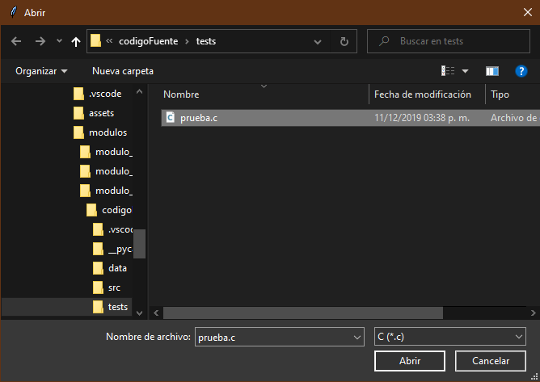
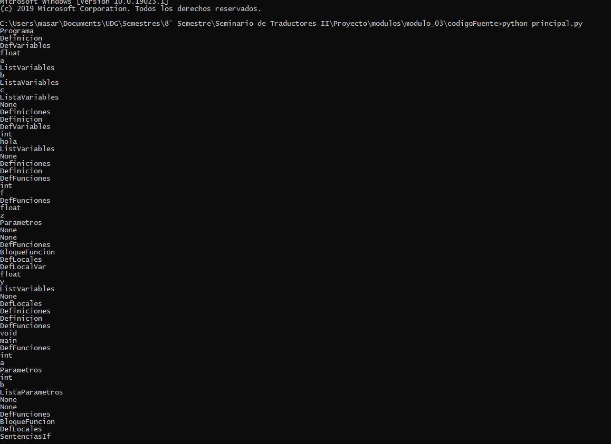
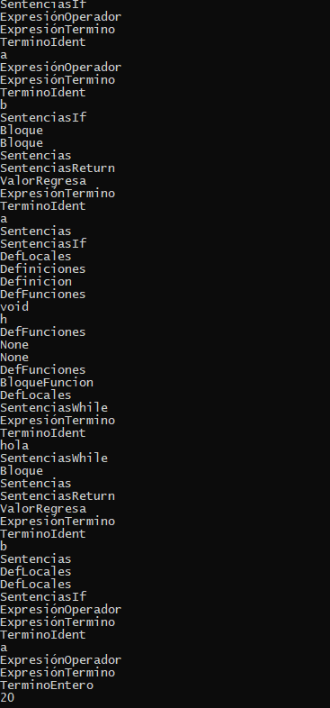
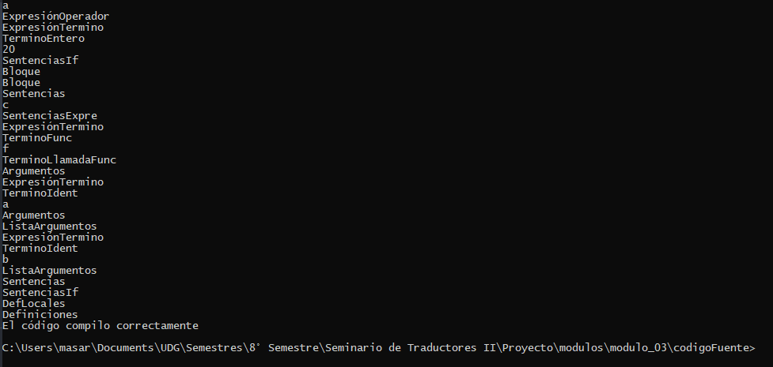
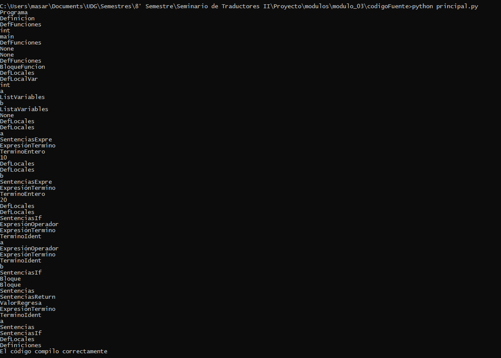
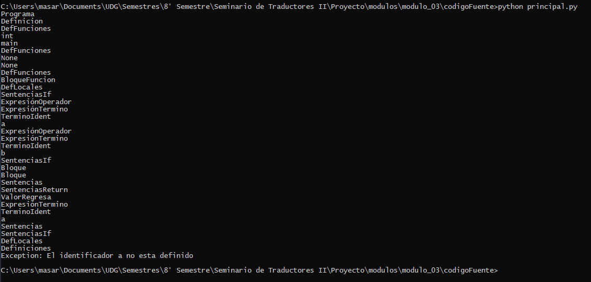
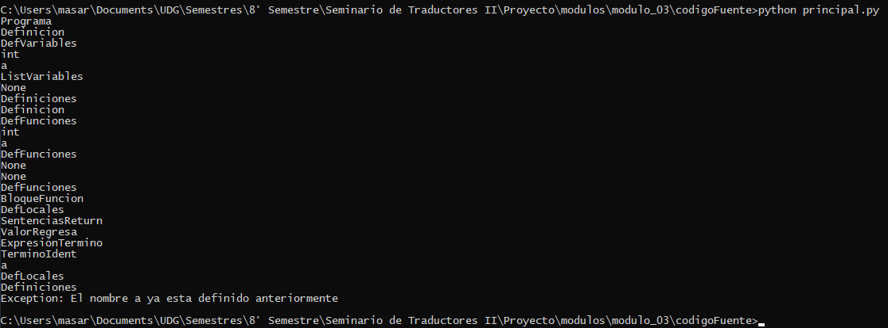

# Proyecto Seminario de Solución de Problemas de Traductores de Lenguajes II

+ Analizador Léxico
+ Analizador Sintáctico
+ Analizador Semántico

## Como utilizar
Es necesario tener instalado python en su versión más reciente, además de `tkinter`.

Ejecutar en una consola el siguiente comando:
<pre>
python principal.py
</pre>

Se abrira una ventana donde podemos elegir el archivo con terminación `.c` que queremos analizar.

## Pruebas
Tenemos cuatro pruebas diferentes

### Prueba 01

El contenido del archivo es el siguiente:
<pre>
float a,b,c;
int hola;
int f(float z){
    float y;
}
void main(int a, int b){
    if(a == b){
        return a;
    }
}
void h(){
    while(hola){
        return b;
    }
    if(a && 20){
        c = f(a,b);
    }
}
</pre>

Esta prueba trata de verificar todos las reglas del compilador.

Una vez seleccionado el archivo, comenzara el analisis y nos mostrara el arbol.

Al final de la tercera imagen podemos ver el mensaje de que el código compilo correctamente.

### Prueba 02

El contenido del archivo es el siguiente:
<pre>
int main(){
    int a,b;
    a = 10;
    b = 20;
    if(a == b){
        return a;
    }
}
</pre>

Una vez seleccionado el archivo, comenzara el analisis y nos mostrara el arbol.

Esta prueba es más sencilla, pues solo es una función y una condicional.

Al final de la tercera imagen podemos ver el mensaje de que el código compilo correctamente.

### Prueba 03

El contenido del archivo es el siguiente:
<pre>
int main(){
    if(a == b){
        return a;
    }
}
</pre>

Una vez seleccionado el archivo, comenzara el analisis y nos mostrara el arbol.

Es parecida a la anterior prueba, pero en este caso no tenemos definición de variables por lo que se genera un error.

Al final de la tercera imagen podemos ver el mensaje de que el identificador a no esta definido.

### Prueba 03

El contenido del archivo es el siguiente:
<pre>
int a;
int a(){
    return a;
}
</pre>

Una vez seleccionado el archivo, comenzara el analisis y nos mostrara el arbol.

En esta pruba tenemos una variable y una función con el mismo identificador, por lo que nos debe mostrar un error.

Al final de la tercera imagen podemos ver el mensaje de que el nombre a ya esta definido.